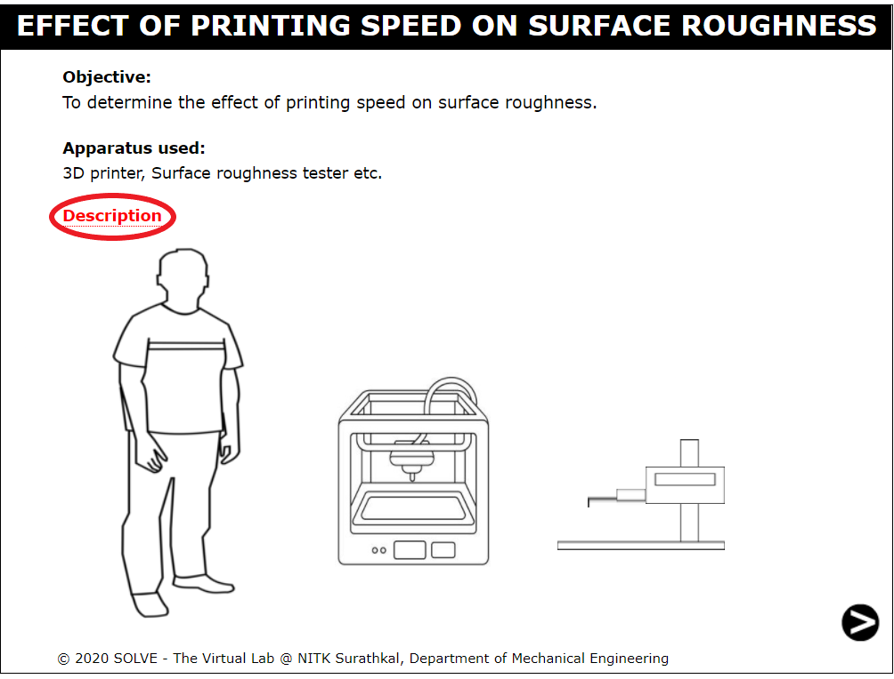
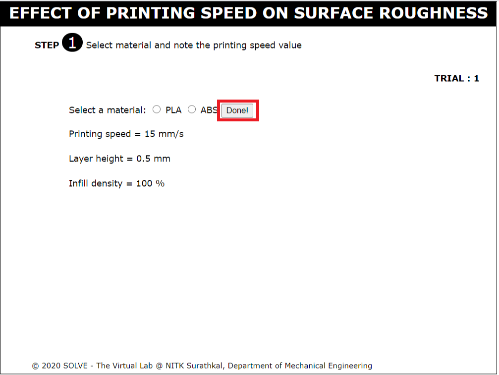

#### These procedure steps will be followed on the simulator

#### Effect of layer height on surface roughness. :

1. When you open effect of layer height on surface roughness experiment, a window will open as shown. After reading the objective and apparatus required,  move mouse pointer over the description to read and recall the basic terms. Then click the NEXT button on the bottom right corner.  
 
 

2. Now, select the material from the two options. All 5 trials will be based on this selection. Press Done! button after selection.  
 

3. Note the layer height value and then click on NEXT Button at the bottom right corner to proceed.  
 

4. Click on the extruder head to start printing. Printing will be completed layer by layer. Notice the number of layers printed. After printing is done, hover over the specimen to zoom in on the number of layers. Then click NEXT Button.
 
 
 

5. Here, click on the specimen to place it in the roughness tester base.  
 

6. Now, click on the tester to lower its testing probe to the surface of the specimen. 
 

7. Now click on the testing probe to conduct the surface roughness test by moving the probe along the surface of the specimen. Once it is done, the surface roughness value will be displayed in the display box. Then click NEXT button. 
 
 

8. Note the new value of layer height and click NEXT Button.  
 

9. The printed specimen will be shown here. Hover on the specimen again to zoom in on the number of layers. Then click NEXT button.  
 
 

10. Repeat the steps for testing surface roughness as above and click NEXT button. 

11. Repeat the same steps in further trials to get values of surface roughness for different values of layer height. Notice the relation. 
 

#### Effect of infill density on surface roughness:

1. When you open effect of infill density on surface roughness experiment, a window will open as shown.  After reading the objective and apparatus required,  move mouse pointer over the description to read and recall the basic terms. Then click the NEXT button on the bottom right corner.  
 
 

2. Now, select the material from the two options. All 5 trials will be based on this selection. Press Done! button after selection.  
 

3. Note the infill density value and then click on NEXT Button at the bottom right corner to proceed.  
 

4. Click on the extruder head to start pinting. Printing will be completed layer by layer. Notice the spacing in the infill layers. After printing is done, click NEXT Button. 
 
 

5. Here, click on the specimen to place it in the roughness tester base. 
 

6. Now, click on the tester to lower its testing probe to the surface of the specimen. 
 

7. Now click on the testing probe to conduct the surface roughness test by moving the probe along the surface of the specimen. Once it is done, the surface roughness value will be displayed in the display box. Then click NEXT button. 
 
 

8. Note the new value of infill density and click NEXT Button.   
 

9. The printed specimen will be shown here. Hover on the specimen again to zoom in on the top view. The top layers will fade out to reveal the infill layers. Note the spacing. Then click NEXT button. 
 
 

10.  Repeat the steps for testing surface roughness as above and click NEXT button. 

11. Repeat the same steps in further trials to get values of surface roughness for different values of infill density. Notice the relation.

#### Effect of printing speed on surface roughness.:

1. When you open effect of printing speed on surface roughness experiment, a window will open as shown. After reading the objective and apparatus required,  move mouse pointer over the description to read and recall the basic terms. Then click the NEXT button on the bottom right corner.  
 
 

2. Now, select the material from the two options. All 5 trials will be based on this selection. Press Done! button after selection.  
 

3. Note the printing speed value and then click on NEXT Button at the bottom right corner to proceed. 
 

4. Click on the extruder head to start pinting. Printing will be completed layer by layer. Notice the speed at which printing is completed. After printing is done, click NEXT Button.  
 
 

5. Here, click on the specimen to place it in the roughness tester base. 
 

6. Now, click on the tester to lower its testing probe to the surface of the specimen. 
 

7. Now click on the testing probe to conduct the surface roughness test by moving the probe along the surface of the specimen. Once it is done, the surface roughness value will be displayed in the display box. Then click NEXT button.  
 
 

8. Note the new value of printing speed and click NEXT Button. 
 

9. Repeat the steps for printing as above. Notice the change in speed of printing. After printing is done, click NEXT button. 
 
 

10. Repeat the steps for testing surface roughness as above and click NEXT button. 

11. Repeat the same steps in further trials to get values of surface roughness for different values of printing speed. Notice the relation.
 
