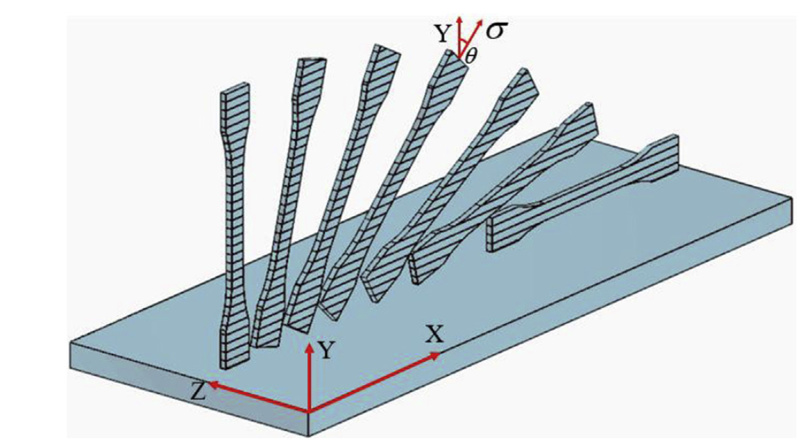

### Fused Deposition Modelling (FDM) process 

It is a 3D printing process where the material is fed into a heated nozzle from a chamber via rollers. The heated material is extruded onto a base plate, which solidifies on the plate. The nozzle/base plate moves in XY plane to deposit a layer of material. The base plate/nozzle moves in Z direction to aid the deposition of next layer on top of first layer. The whole product is built layer by layer.

  </img>  
FDM Process Schematic  
( Source: I. J. Solomon, P. Sevvel, and J. Gunasekaran, “A review on the various processing parameters in FDM,” Mater. Today Proc., no. xxxx, pp. 10–15, 2020.)

### Process Parameters:
#### 1) Material

The materials used here are PLA (Poly Lactic Acid) and ABS (Acrylonitrile Butadiene Styrene). 3D printed ABS can be employed for end use applications due to its higher flexural strength and better elongation before breaking, whereas PLA is mostly used for rapid prototyping when form is more critical than function.

#### 2) Layer height

It is the height of individual layers. For a given component, more layer height means lesser number of layers will be required to build it. Usually it is around the range of 50 &#181m - 500 &#181m. Lesser layer heights are preferred for more adhesion between layers and strength. Layer height should not be more than the nozzle diameter. Sometimes, a layer can be misaligned with the layers above and below it, leading to a defect called z-wobble.

  </img>  
Layer Height  
( Source: I. J. Solomon, P. Sevvel, and J. Gunasekaran, “A review on the various processing parameters in FDM,” Mater. Today Proc., no. xxxx, pp. 10–15, 2020. )

#### 3) Infill density

It is the amount of material filled in the product. Usually, fully compact (solid) top and bottom layers and a shell will be printed. The cavity formed like this will be filled with material. The percentage volume of the cavity that is filled is the infill density. Usually for FDM processes infill density is taken as low values in the range 18%-20%, due to importance of time and cost savings over strength.

  </img>  
Infill Density in percentage  
( Source: https://all3dp.com/2/infill-3d-printing-what-it-means-and-how-to-use-it/ )

#### 4) Print speed

The speed at which the extruder moves while depositing material. Increased speed can reduce the time required to print the specimen. But higher print speeds lead to defects like ghosting. Ghosting consists of small lines that repeat themselves on the surface of the specimen, caused by vibrations due to the inertia of the extruder when there are sudden direction changes at high speeds. At the same time, very low speeds can lead to the heated extruder to remain in the same region for more time leading to overheating of material and curling, where the layers will collapse or sag due to high temperature. Low speeds can also lead to stringing, where some filament has dripped from the nozzle during passing through an open area. The extruder head is usually at temperatures in the range of 200&deg;C-250&deg;C for PLA and ABS material.

### Effected Parameters:
#### Surface roughness

Surface roughness is measured as Ra or average surface roughness. The Ra value indicates the average surface roughness for the length of the measurement performed, i.e., the average difference between peaks and valleys. It is measured using a probe that travels along the surface of the specimen, and picks up the peaks and valleys with up and down motion.

### Fixed Parameters:
#### 1) Part Geometry

Geometry of part is fixed as 80*10*4 mm³ which is a ASTM standard specimen size.

  </img>  
Part Geometry  

 

#### 2) Raster pattern

It is the pattern in which the raster is applied. Line or recti-linear pattern is used here.

  </img>  
Rectilinear raster pattern at ±45° angle in alternate layers  
( Source:https://www.researchgate.net/figure/Rectilinear-infill-pattern-for-a-a-single-layer-b-multiple-layers-and-c-observed_fig2_330366307)

#### 3) Number of top and bottom layers and shell and shell thickness.

Number of top and bottom layers is taken as 2 and 2 shells with 0.8 mm wall thickness is selected.

  </img>  
The shell and top/bottom layers  
( Source: https://www.3dhubs.com/knowledge-base/selecting-optimal-shell-and-infill-parameters-fdm-3d-printing/ )

#### 4) Build Orientation

It is the orientation at which the product will be printed on the build plate. Build orientation is fixed as 0° or flat. The build plate will be kept at a lower temperature like 60&deg;C.

  </img>  
Build orientation  
( Source: T. Yao, Z. Deng, K. Zhang, and S. Li, “A method to predict the ultimate tensile strength of 3D printing polylactic acid (PLA) materials with different printing orientations,” Compos. Part B Eng., vol. 163, no. December 2018, pp. 393–402, 2019. )

