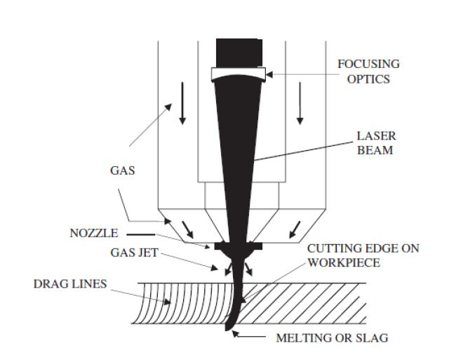
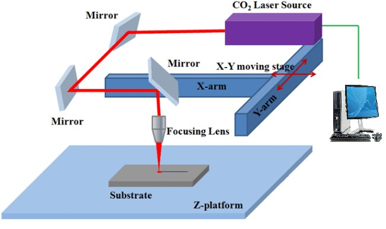
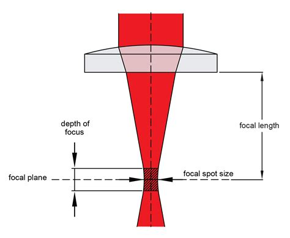

### Laser Cutting process 

Laser cutting is a thermal based non-contact process capable of cutting complex contour on materials with high degree of precision and accuracy. It involves process of heating, melting and evaporation of material in a small well defined area and capable of cutting almost all materials. The laser beam is directed towards the nozzle using mirrors and focused using a lens to a point on the surface of the material, where it causes heating, which leads to evaporation of material and thus cut is made. The two main types of laser used in laser cutting is Nd:YAG laser and CO2 laser. Here, a CO2 laser is used.

  </img>  
Laser Cutting Process Schematic  
( Source: Miraoui, Imed & Boujelbene, Mohamed & Zaied, Mouna, “High-Power Laser Cutting of Steel Plates: Heat Affected Zone Analysis”, Advances in Materials Science and Engineering, 1-8, 2016)

  

  </img>  
Laser Cutting Machine Schematic  
( Source: http://www.master-laser.cn)

### Process Parameters:
#### 1) Laser power

Laser power is the total energy emitted in the form of laser light per second. High beam intensity, obtained by focusing the laser beam to a small spot, is desirable for cutting applications because it causes rapid heating of the kerf leaving little time for the heat to dissipate to the surrounding which results into high cutting speeds and excellent cut quality. The optimum incident power is established during procedure development because excessive power results in a wide kerf width(which is the amount of material that is burned away by the laser) and an increase in dross(molten matter produced during laser cutting that sticks to the bottom edges of the cut) while insufficient power cannot initiate cutting.

#### 2) Cutting speed

It is the speed at which the nozzle moves to make the cut. The energy lost from the cut zone is directly dependent on cutting speed. The loss of energy decreases with increasing cutting speed because of lesser time spent at cut zone. A reduction in cutting speed when cutting thicker materials leads to an increase in the wasted energy and the process becomes less efficient. In general, the cutting speed for a material is inversely proportional to its thickness.

#### 3) Assist gas pressure

The process gas has few principle functions during laser cutting. An inert gas such as nitrogen expels molten material without allowing drops to solidify on the underside (dross) while an active gas such as oxygen participates in an exothermic reaction with the material. The gas also acts to suppress the formation of plasma when cutting thick sections with high beam intensities and focusing optics are protected from spatter by the gas flow. The cut edge is cooled by the gas flow thus restricting the width of the HAZ(Heat Affected Zone). The commonly used gases are oxygen (active gas) and nitrogen (inert gas). Here, nitrogen gas is used. The nitrogen pressure lies in the range of 10-20 bar and the pressure requirement increases with increasing material thickness. Processing speeds are lower for nitrogen assisted cutting than in oxygen assisted cutting.

### Effected Parameters:
#### Surface roughness

Surface roughness is measured as Ra or average surface roughness. The Ra value indicates the average surface roughness for the length of the measurement performed, i.e., the average difference between peaks and valleys. It is measured using a probe that travels along the surface of the specimen, and picks up the peaks and valleys with up and down motion.

### Fixed Parameters:
#### 1) Material and material thickness

The material to cut is fixed as stainless steel. Material thickness can also have ana effect on the cutting process. Here the material thickness is fixed as 5mm.

#### 2) Focal length of lens

A lens is used in CO2 laser cutting to focus the laser beam on the surface of material to be cut. These lenses are usually made of either germanium or zinc selenide. The focal length of the focusing lens determines the focused spot size and also the depth of focus which is the effective distance over which satisfactory cutting can be achieved.  Here the focal length is fixed as constant for all trials.

  </img>  
Focal length of laser beam  
( Source:https://lasergods.com/laser-lenses-optics-and-focus/)

